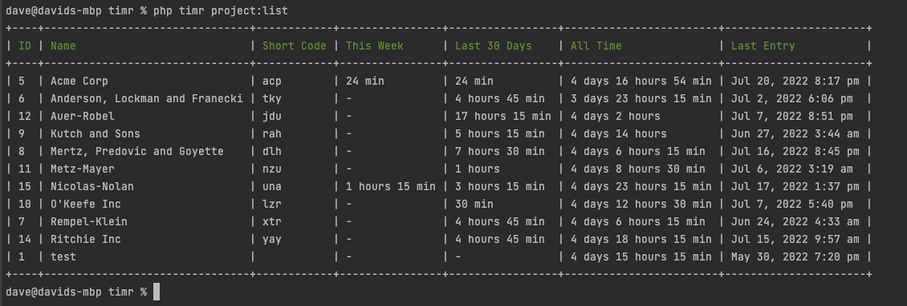
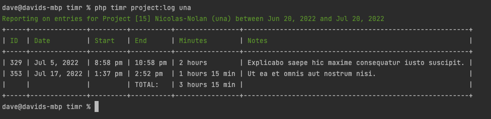
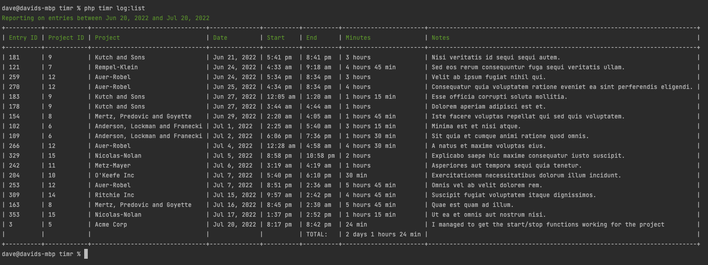

# timr

an open source project created by [David Hallin](https://davidhallin.com),
using [laravel-zero](https://laravel-zero.com/) to track the time you spend on projects, all within the terminal.

## why?

I wanted to track the time I was spending on some of my projects. I looked at services like [Toggl](https://toggl.com),
but I never remember to open the app.

I figured if I had something accessible from command line, it'd be easier because I basically always have at least a
terminal window open.

## commands / usage

**new project**

```bash
# Create a new project using the prompts
php timr project:new   

# Create a new project with name _Acme Corp Project_
php timr project:new "Acme Corp Project"

# Create a new project with the name _Acme Corp Project_ and a short code of acp
php timr project:new "Acme Corp Project" acp
```

---

**edit project**

```bash
# Edit project with id of 7 (will prompt you for each field)
php timr project:edit 7
```

---

**list projects**

```bash
# Output a list of projects in your database
php timr project:list
```

_sample output_


---

**delete project**

```bash
# Delete project with ID of 7 (will ask you to confirm delete)
php timr project:delete 7
```

---

**begin working on project**

```bash
# Begin time tracking on project (using prompts)
php timr project:start

# Begin time tracking on project with short code of acp
php timr project:start acp 
```

---

**stop working on project**

```bash
# End project time tracking (will prompt you to select which project, if more than 1 are active)
php timr project:stop 
```

---

**show project entries**

```bash
# Show Time Entries for project with short code of una
php timr project:log una

# Show time log entries for project with short code of una, between 2022-01-01 and 2022-02-01
php timr project:log una --from=2022-01-01 --to=2022-02-01
```

_sample_


---

**show non-project specific entries**

```bash
# Display time tracking entries for all projects (default -30 days to now)
php timr log:list

# Display time tracking entries for all projects between 2022-01-01 and 2022-12-31
php timr log:list --from=2022-01-01 --to=2022-12-31
```

_sample_


---

**edit time log entry**

```bash
# edit time log entry with ID of 21 (look on log:list or project:log to get the ID.  Will prompt for each field)
php timr log:edit 21
```

---

**delete time log entry**

```bash
# delete time log entry with id of 21.  Will confirm before deleting
php timr log:delete 21
```

## installation / getting started

1. clone the repo
2. run `touch database.sqlite` to create your database file where ever you'd like to save
   it. [read note](https://laravel-zero.com/docs/database#note-on-phar-builds) on where to put your database.sqlite file
   if you're planning on building the PHAR, (so you don't need to do php infront of every command)
3. run `php timr migrate` to set up your database
4. run `php timr list` to check out the commands you can run
5. have fun!

## license

timr is an open-source software licensed under the MIT license.

## support

to say thanks, you can share the project on social media or <br />

<a href="https://www.buymeacoffee.com/tDbQ4kg" target="_blank"></a>

## issues

please report all issues in the GitHub Issue tracker

## contributing

shoot me an email, or DM me on twitter and I am happy to allow other contributors.
